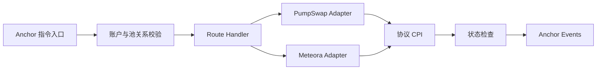

# sol-arb-executor

一个基于 Anchor 的 Solana 链上执行器，封装 PumpSwap AMM 与 Meteora DLMM 的 CPI
调用、账户验证、原子执行和事件输出。

## Program instructions

- `execute_pump_to_meteora`
- `execute_meteora_to_pump`

## 架构设计

执行器由指令入口、账户验证、协议 Adapter、状态检查和事件输出五部分组成。所有协议调用
均在单条 Solana 指令内完成；任一校验或 CPI 失败时，整条指令原子回滚。



`lib.rs` 只暴露预先定义的执行入口；`instructions/` 负责账户上下文和执行编排；
`adapters/` 隔离第三方协议账户布局及 CPI 编码；`utils/` 提供可复用的账户与数值检查。
执行状态通过 Anchor Events 输出，Program 本身不创建额外的持久化状态账户。

### 模块说明

| 路径                                   | 职责                                                                                      |
| -------------------------------------- | ----------------------------------------------------------------------------------------- |
| `programs/sol-arb-executor/src/lib.rs` | Anchor Program 入口，暴露固定指令并转发给对应 handler。                                   |
| `instructions/mod.rs`                  | 定义共享的 `ExecuteRoute` 账户集合，并构造各协议需要的账户视图。                          |
| `instructions/pump_to_meteora.rs`      | `execute_pump_to_meteora` 的链上执行编排。                                                |
| `instructions/meteora_to_pump.rs`      | `execute_meteora_to_pump` 的链上执行编排。                                                |
| `instructions/post_trade_checks.rs`    | 校验动态执行参数，计算第二腿最低回收量，并检查最终利润和目标币余额。                      |
| `adapters/pump_swap.rs`                | PumpSwap Pool 验证、指令编码和 CPI 封装。                                                 |
| `adapters/meteora_dlmm.rs`             | Meteora LB Pair、Bitmap、Bin Array 验证及 CPI 封装。                                      |
| `utils/account_validation.rs`          | 解析外部协议账户的稳定字段前缀，校验 mint、vault/reserve、owner、discriminator 和池归属。 |
| `utils/token_extensions.rs`            | 绑定 Mint、Token Account 与 Token Program，并对白名单内的基础 Token-2022 扩展放行。       |
| `utils/balance.rs`                     | 使用 checked arithmetic 计算 reload 前后的正向余额增量。                                  |
| `constants.rs`                         | 固定 WSOL Mint、DEX Program、Fee Program 和 Memo Program 地址。                           |
| `errors.rs`                            | 集中定义账户、池、余额和算术错误。                                                        |
| `events.rs`                            | 定义执行生命周期事件，供外部系统观测交易状态。                                            |
| `scripts/`                             | 从环境变量和账户 JSON 组装指令；默认模拟，仅显式开启后广播。                              |
| `tests/`                               | Rust 单元测试、TypeScript 指令构造测试及后续集成测试说明。                                |
| `docs/`                                | 架构细节、协议来源、固定版本和兼容性决策。                                                |

### 账户与信任边界

- `trader` 必须签名；`user_wsol` 和 `user_target` 必须由该地址拥有且 mint 匹配。
  WSOL 固定使用 Legacy SPL Token；目标币可使用 Legacy SPL Token 或受支持的 Token-2022。
- `wsol_token_program` 固定为 `Tokenkeg...`；`target_token_program` 必须与目标 Mint 和
  目标 Token Account 的链上 owner 一致，且只能是 `Tokenkeg...` 或 `TokenzQd...`。
- Token-2022 目标 Mint 当前仅允许 `MetadataPointer` 和 `TokenMetadata`；任何其他扩展
  都会在进入 DEX CPI 前被明确拒绝。
- PumpSwap 和 Meteora Program ID 固定在 `constants.rs`，调用者不能替换 CPI 目标。
- Program 会交叉检查 Pump Pool 的 base/quote mint 与 vault，以及 Meteora LB Pair 的
  token X/Y mint 与 reserve，不能只依赖调用者提供的账户顺序。
- PumpSwap 的 `pool_v2` PDA 会按 target mint 派生校验；当前协议要求的 buyback fee
  recipient 及其 quote-token ATA 作为固定账户传入，不占用路线 remaining accounts。
- Meteora Bin Array 是唯一允许的 `remaining_accounts`：数量必须为 1–8，必须 writable、
  non-signer、由官方 DLMM Program 拥有，并且内嵌 `lb_pair` 必须匹配本次路线。
- 外部协议仍会校验其 global config、oracle、event authority、fee recipient 等协议专属
  PDA；本 Program 在 CPI 前补充与路线强相关的结构和归属校验。

### 动态执行参数与利润条件

两个方向的指令都接收相同的动态参数，客户端可逐笔设置：

| 参数                  | 类型  | 含义                                                  |
| --------------------- | ----- | ----------------------------------------------------- |
| `wsol_amount_in`      | `u64` | 第一腿固定投入的 WSOL 数量，单位为 lamports。         |
| `min_profit_lamports` | `u64` | 第二腿完成后要求的最小 WSOL 毛利润，单位为 lamports。 |

Program 在第一腿前记录用户 WSOL 和目标币余额，第一腿只投入
`wsol_amount_in`，随后以实际收到的目标币增量作为第二腿输入。第二腿要求的最低 WSOL
输出由链上余额动态计算：

```text
required_final_wsol = initial_wsol + min_profit_lamports
required_second_leg_out = max(required_final_wsol - wsol_before_second_leg, 1)
```

第二腿 CPI 完成后还会再次检查 `final_wsol >= required_final_wsol`，并要求目标币余额恢复到
交易前数值。任何条件不满足都会返回错误，第一腿和第二腿的全部状态变化随交易原子回滚。
这里计算的是 WSOL 账户内的交易毛利润，不包含交易基础费、优先费或其他由 fee payer
支付的链外余额成本。

### 扩展原则

新增协议时，在 `adapters/` 中增加独立 Adapter，并在 `instructions/` 中增加显式指令或
handler。每个 Adapter 应固定目标 Program ID、验证协议账户关系，并只暴露执行器需要的
CPI 能力。通用状态检查放入 `post_trade_checks`，避免将检查逻辑散落在各 Adapter 中。

## Pinned environment

- Anchor CLI / crates: 0.31.1
- Solana CLI (Agave): 2.2.21
- Rust: 1.88.0
- Node: 22.x; npm 10.x
- PumpSwap official IDL commit: `9c82f61cb711b044a17f770ab8ce9f9bdf78f333`
- Meteora DLMM SDK/IDL commit: `fb02e51ae677bbd18e76543f702dae40632426db`

See [docs/protocol-versions.md](docs/protocol-versions.md) for source links and
compatibility decisions.

## Mainnet validation milestone

2026-08-10，部署在主网的执行器完成了首次真实盈利原子执行验证；2026-08-11，升级后的
执行器再次完成盈利原子执行。截至该里程碑，已固定三笔可公开核验的成功交易，合计 WSOL
毛利润为 `218,614` lamports，仅扣除三笔成功交易各自的基础网络费后为 `203,614`
lamports。

2026-08-13，链上执行容错性增强版完成发布前验收，公开指令接口保持兼容，受控成功路径维持在
`300,000 CU` 预算内；主网升级状态以里程碑文档中的链上签名为准。

2026-08-14，支持 Pump cashback 相关账户的执行器版本完成主网验证，并新增一笔可公开核验的
盈利原子执行。截至当前已固定四笔成功交易，合计 WSOL 毛利润为 `599,126` lamports；仅扣除
四笔成功交易各自的网络费后为 `578,226` lamports。

交易签名、余额计算方式和验证边界见
[docs/mainnet-milestones.md](docs/mainnet-milestones.md)。该记录仅证明对应版本和交易输入下的
主网执行结果，不代表安全审计结论，也不公开客户端机会发现或交易选择策略。

## Setup and verification

```bash
npm ci
anchor build
cargo fmt --all -- --check
cargo clippy --workspace --all-targets -- -D warnings
cargo test --workspace
npm run typecheck
npm run test:ts
npm run test:integration
```

真实协议 CPI 兼容性使用 Surfpool 单独验证。池地址仅通过环境变量提供，不写入仓库；具体
命令和账户要求见 [tests/integration/README.md](tests/integration/README.md)。

The checked-in program address is a newly generated public key only. No deploy
keypair is committed. Before deploying, place the corresponding deployment key
at `target/deploy/sol_arb_executor-keypair.json`, or replace every declared
program address with one controlled by your deployment process.

## Required accounts

The client must prepare the user's WSOL and target-token accounts. WSOL uses the
legacy SPL Token program. The target account must use the same program that owns
the target mint: either legacy SPL Token or the supported Token-2022 subset. The
client passes these separately as `wsol_token_program` and
`target_token_program`, plus all fixed PumpSwap and Meteora accounts named in
the generated Anchor IDL.
其中包括当前 PumpSwap 接口使用的 pool-v2 与 buyback fee 账户。

Meteora bin arrays are the only route `remaining_accounts`. Their order must
match the order expected by the DLMM instruction. Every entry must be:

1. writable and non-signer;
2. owned by the official Meteora DLMM program;
3. a `BinArray` account whose embedded `lb_pair` equals `meteora_lb_pair`.

Transfer-hook accounts must not be mixed into this list. Transfer Hook mints are
rejected, so Meteora `swap2` encodes zero-length transfer-hook slices.

## Simulation

Copy `.env.example` to `.env`, populate it, and supply `ROUTE_ACCOUNTS_FILE` as
a JSON object containing every named account printed by the script template.
`ADDRESS_LOOKUP_TABLE` is also required: the account-heavy route plus compute
budget instruction exceeds the legacy transaction size, so the scripts compile
a v0 transaction. Then run:

```bash
npm run simulate:pump-to-meteora
npm run simulate:meteora-to-pump
```

The scripts call `simulateTransaction` by default and print the account summary,
return error, units consumed, and complete logs. They refuse to send unless
`SEND_REAL_TRANSACTION=true` is explicitly set.

### 固定间隔主网冒烟批次

`scripts/mainnet-smoke.ts` 的批次模式将发送器与状态监控器分离。发送器不会等待上一笔交易
确认，而是按“启动时间 + 序号 × `TRANSACTION_INTERVAL_MS`”的绝对时间表调度。后台独立
刷新 route snapshot 和 recent blockhash，交易 N 广播时，后续交易可以并行构建和签名；
`SENDER_MAX_IN_FLIGHT` 限制在途构建/广播数量，避免 RPC 变慢时无限堆积。
批次模式强制要求配置一个已经激活的 `ADDRESS_LOOKUP_TABLE`，不会在主网批次开始时自动
创建并锁定新租金，也避免新 ALT 尚未完成 slot warmup 时发送交易。

```bash
TRANSACTION_COUNT=200 \
TRANSACTION_INTERVAL_MS=3000 \
TRANSACTION_DIRECTION=pump-to-meteora \
COMPUTE_UNIT_LIMIT=300000 \
COMPUTE_UNIT_PRICE_MICRO_LAMPORTS=300 \
SENDER_MAX_IN_FLIGHT=3 \
WSOL_AMOUNT_IN=10000000 \
MIN_PROFIT_LAMPORTS=10000 \
SEND_REAL_TRANSACTION=true \
npm run smoke:mainnet
```

`TRANSACTION_COUNT` 表示生成并广播的唯一签名数量，而不是保证落链的数量。全部签名广播完成后，
监控器会继续运行，直到每笔交易成功、回滚或 blockhash 过期。发送清单默认写入
`target/mainnet-smoke-broadcasts-<timestamp>.json`；可用 `BROADCAST_MANIFEST_FILE` 指定路径，
并用 `MONITOR_REPORT_FILE` 指定独立的监控结果文件。每条记录包含：

- 广播时间和签名；
- 计划广播时间、实际广播偏差 `scheduleDelayMs`、构建签名耗时和 RPC ACK 耗时；
- 获取 recent blockhash 时 RPC 返回的 `blockhashContextSlot`；
- blockhash 年龄、route snapshot 版本和 snapshot 年龄；
- 广播请求发出时并行采样的 `broadcastObservedSlot`；
- 落链 slot 和该交易在区块中的位置（从 1 开始）；
- `blockhashContextToLandedSlotDelta` 和 `broadcastToLandedSlotDelta`；
- `success`、`reverted` 或 `expired` 状态；
- Anchor/协议错误类型及原始错误；
- CU 消耗和手续费 lamports。

RPC 对同一签名的内部重试不增加 `TRANSACTION_COUNT`，也不会生成额外链上交易。如果 RPC
ACK 返回错误，发送器仍记录本地已经生成的签名并交给监控器判断是否落链，避免因不确定响应
重新签名并产生重复成交。只有构建或签名前失败时才重试同一序号。

默认计算预算为 `300,000 CU` 和 `300 micro-lamports/CU`，对应每笔 `90 lamports`
优先费。Loaded Accounts Data Size limit 暂不猜测设置；应先分别模拟固定方向和链上选方向，
测出安全下限并预留余量后再启用。

## Security boundaries and current limitations

- CPI targets are hard-coded to the official PumpSwap and Meteora program IDs.
- Pool mint/vault relations and bin-array ownership are checked before CPI.
- No ATA creation or SOL wrapping/unwrapping occurs inside the program.
- Token-2022 is limited to mints whose extension set contains only
  `MetadataPointer` and/or `TokenMetadata`. Transfer Fee, Transfer Hook and all
  other Token-2022 extensions are rejected until explicitly implemented.
- Pump cashback pools are supported: the adapter validates the user-volume
  accumulator and cashback WSOL ATA, then forwards the protocol-required
  cashback accounts for the relevant buy or sell CPI.
- The PumpSwap IDL evolves frequently (fee program, creator vault, volume
  accumulators, virtual quote reserves); re-run the protocol audit before a
  production deployment.
- Smoke simulation requires live pool-specific fee recipient, creator, oracle,
  bitmap, and bin-array accounts supplied by the caller.
- The Agave 2.2.21 post-link checker warns that standard Solana syscalls are
  unknown, but the emitted SBF has successfully executed both routes and nested
  Token CPIs under the matching local validator. See
  `docs/protocol-versions.md` for the exact verification boundary.
- `npm install` currently reports transitive audit findings from the pinned
  Solana/Meteora dependency graph. Review them before using the scripts in an
  environment that handles production signing keys.
