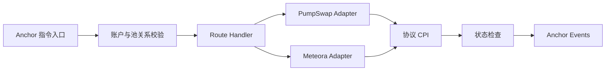

# sol-arb-executor

一个基于 Anchor 的 Solana 链上执行器，封装 PumpSwap AMM 与 Meteora DLMM 的 CPI
调用、账户验证、原子执行和事件输出。

## Program instructions

- `execute_pump_to_meteora`
- `execute_meteora_to_pump`

## 架构设计

执行器由指令入口、账户验证、协议 Adapter、状态检查和事件输出五部分组成。所有协议调用
均在单条 Solana 指令内完成；任一校验或 CPI 失败时，整条指令原子回滚。



`lib.rs` 只暴露预先定义的执行入口；`instructions/` 负责账户上下文和执行编排；
`adapters/` 隔离第三方协议账户布局及 CPI 编码；`utils/` 提供可复用的账户与数值检查。
执行状态通过 Anchor Events 输出，Program 本身不创建额外的持久化状态账户。

### 模块说明

| 路径 | 职责 |
| --- | --- |
| `programs/sol-arb-executor/src/lib.rs` | Anchor Program 入口，暴露固定指令并转发给对应 handler。 |
| `instructions/mod.rs` | 定义共享的 `ExecuteRoute` 账户集合，并构造各协议需要的账户视图。 |
| `instructions/pump_to_meteora.rs` | `execute_pump_to_meteora` 的链上执行编排。 |
| `instructions/meteora_to_pump.rs` | `execute_meteora_to_pump` 的链上执行编排。 |
| `instructions/post_trade_checks.rs` | 统一的执行后状态检查扩展点。 |
| `adapters/pump_swap.rs` | PumpSwap Pool 验证、指令编码和 CPI 封装。 |
| `adapters/meteora_dlmm.rs` | Meteora LB Pair、Bitmap、Bin Array 验证及 CPI 封装。 |
| `utils/account_validation.rs` | 解析外部协议账户的稳定字段前缀，校验 mint、vault/reserve、owner、discriminator 和池归属。 |
| `utils/balance.rs` | 使用 checked arithmetic 计算 reload 前后的正向余额增量。 |
| `constants.rs` | 固定 WSOL Mint、DEX Program、Fee Program 和 Memo Program 地址。 |
| `errors.rs` | 集中定义账户、池、余额和算术错误。 |
| `events.rs` | 定义执行生命周期事件，供外部系统观测交易状态。 |
| `scripts/` | 从环境变量和账户 JSON 组装指令；默认模拟，仅显式开启后广播。 |
| `tests/` | Rust 单元测试、TypeScript 指令构造测试及后续集成测试说明。 |
| `docs/` | 架构细节、协议来源、固定版本和兼容性决策。 |

### 账户与信任边界

- `trader` 必须签名；`user_wsol` 和 `user_target` 必须是由该地址拥有、mint 匹配的
  Legacy SPL Token 账户。
- PumpSwap 和 Meteora Program ID 固定在 `constants.rs`，调用者不能替换 CPI 目标。
- Program 会交叉检查 Pump Pool 的 base/quote mint 与 vault，以及 Meteora LB Pair 的
  token X/Y mint 与 reserve，不能只依赖调用者提供的账户顺序。
- PumpSwap 的 `pool_v2` PDA 会按 target mint 派生校验；当前协议要求的 buyback fee
  recipient 及其 quote-token ATA 作为固定账户传入，不占用路线 remaining accounts。
- Meteora Bin Array 是唯一允许的 `remaining_accounts`：数量必须为 1–8，必须 writable、
  non-signer、由官方 DLMM Program 拥有，并且内嵌 `lb_pair` 必须匹配本次路线。
- 外部协议仍会校验其 global config、oracle、event authority、fee recipient 等协议专属
  PDA；本 Program 在 CPI 前补充与路线强相关的结构和归属校验。

### 扩展原则

新增协议时，在 `adapters/` 中增加独立 Adapter，并在 `instructions/` 中增加显式指令或
handler。每个 Adapter 应固定目标 Program ID、验证协议账户关系，并只暴露执行器需要的
CPI 能力。通用状态检查放入 `post_trade_checks`，避免将检查逻辑散落在各 Adapter 中。

## Pinned environment

- Anchor CLI / crates: 0.31.1
- Solana CLI (Agave): 2.2.21
- Rust: 1.88.0
- Node: 22.x; npm 10.x
- PumpSwap official IDL commit: `9c82f61cb711b044a17f770ab8ce9f9bdf78f333`
- Meteora DLMM SDK/IDL commit: `fb02e51ae677bbd18e76543f702dae40632426db`

See [docs/protocol-versions.md](docs/protocol-versions.md) for source links and
compatibility decisions.

## Setup and verification

```bash
npm ci
anchor build
cargo fmt --all -- --check
cargo clippy --workspace --all-targets -- -D warnings
cargo test --workspace
npm run typecheck
npm run test:ts
npm run test:integration
```

真实协议 CPI 兼容性使用 Surfpool 单独验证。池地址仅通过环境变量提供，不写入仓库；具体
命令和账户要求见 [tests/integration/README.md](tests/integration/README.md)。

The checked-in program address is a newly generated public key only. No deploy
keypair is committed. Before deploying, place the corresponding deployment key
at `target/deploy/sol_arb_executor-keypair.json`, or replace every declared
program address with one controlled by your deployment process.

## Required accounts

The client must prepare the user's WSOL and target-token accounts. Both must be
legacy SPL Token accounts owned by the signing user. The client must also pass
all fixed PumpSwap and Meteora accounts named in the generated Anchor IDL.
其中包括当前 PumpSwap 接口使用的 pool-v2 与 buyback fee 账户。

Meteora bin arrays are the only route `remaining_accounts`. Their order must
match the order expected by the DLMM instruction. Every entry must be:

1. writable and non-signer;
2. owned by the official Meteora DLMM program;
3. a `BinArray` account whose embedded `lb_pair` equals `meteora_lb_pair`.

Transfer-hook accounts must not be mixed into this list. The MVP permits only
the legacy SPL Token program, so Meteora `swap2` encodes zero-length transfer
hook slices.

## Simulation

Copy `.env.example` to `.env`, populate it, and supply `ROUTE_ACCOUNTS_FILE` as
a JSON object containing every named account printed by the script template.
`ADDRESS_LOOKUP_TABLE` is also required: the account-heavy route plus compute
budget instruction exceeds the legacy transaction size, so the scripts compile
a v0 transaction. Then run:

```bash
npm run simulate:pump-to-meteora
npm run simulate:meteora-to-pump
```

The scripts call `simulateTransaction` by default and print the account summary,
return error, units consumed, and complete logs. They refuse to send unless
`SEND_REAL_TRANSACTION=true` is explicitly set.

## Security boundaries and current limitations

- CPI targets are hard-coded to the official PumpSwap and Meteora program IDs.
- Pool mint/vault relations and bin-array ownership are checked before CPI.
- No ATA creation or SOL wrapping/unwrapping occurs inside the program.
- Token-2022, transfer hooks, Pump cashback remaining accounts, and Meteora host
  fees are not supported in the MVP.
- The PumpSwap IDL evolves frequently (fee program, creator vault, volume
  accumulators, virtual quote reserves); re-run the protocol audit before a
  production deployment.
- Smoke simulation requires live pool-specific fee recipient, creator, oracle,
  bitmap, and bin-array accounts supplied by the caller.
- The Agave 2.2.21 post-link checker warns that standard Solana syscalls are
  unknown, but the emitted SBF has successfully executed both routes and nested
  Token CPIs under the matching local validator. See
  `docs/protocol-versions.md` for the exact verification boundary.
- `npm install` currently reports transitive audit findings from the pinned
  Solana/Meteora dependency graph. Review them before using the scripts in an
  environment that handles production signing keys.
